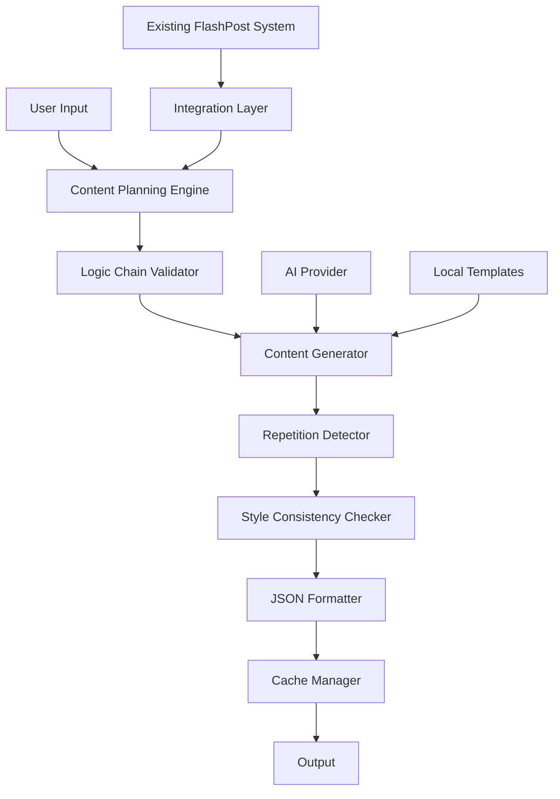

# Design Document: Enhanced Content Generation System

## Overview

Данный документ описывает дизайн улучшенной системы генерации контента для FlashPost Mini App. Система будет создавать логически связанные Instagram-карусели без повторений, где каждый слайд развивает предыдущий и раскрывает новую часть темы.

## Architecture

### High-Level Architecture



### System Components

1. **Content Planning Engine** - Создает общий план карусели перед генерацией слайдов
2. **Logic Chain Validator** - Проверяет логическую связность между слайдами
3. **Content Generator** - Генерирует контент с учетом контекста предыдущих слайдов
4. **Repetition Detector** - Обнаруживает и предотвращает повторения фраз и слов
5. **Style Consistency Checker** - Обеспечивает единый стиль и тон
6. **Integration Layer** - Интегрируется с существующей системой FlashPost

## Components and Interfaces

### Content Planning Engine

```typescript
interface ContentPlan {
  topic: string;
  targetAudience: string;
  overallNarrative: string;
  slideOutlines: SlideOutline[];
  keyMessages: string[];
  transitionPoints: TransitionPoint[];
}

interface SlideOutline {
  slideNumber: number;
  purpose: string;
  mainMessage: string;
  supportingPoints: string[];
  connectionToPrevious: string;
  connectionToNext: string;
}

class ContentPlanningEngine {
  async createContentPlan(topic: string, theme: string): Promise<ContentPlan>
  validatePlanCoherence(plan: ContentPlan): ValidationResult
  adjustPlanForTheme(plan: ContentPlan, theme: string): ContentPlan
}
```

### Logic Chain Validator

```typescript
interface LogicChain {
  slides: SlideContent[];
  connections: Connection[];
  coherenceScore: number;
}

interface Connection {
  fromSlide: number;
  toSlide: number;
  connectionType: 'causal' | 'sequential' | 'elaborative' | 'contrasting';
  strength: number;
}

class LogicChainValidator {
  validateChain(slides: SlideContent[]): LogicChain
  identifyWeakConnections(chain: LogicChain): Connection[]
  suggestImprovements(chain: LogicChain): Improvement[]
}
```

### Content Generator

```typescript
interface GenerationContext {
  topic: string;
  contentPlan: ContentPlan;
  previousSlides: SlideContent[];
  currentSlideIndex: number;
  usedPhrases: Set<string>;
  usedStartingWords: Set<string>;
}

interface SlideContent {
  slideNumber: number;
  title: string;
  text: string;
  purpose: string;
  keyPhrases: string[];
  startingWords: string[];
}

class ContentGenerator {
  async generateSlide(context: GenerationContext): Promise<SlideContent>
  async generateCarousel(plan: ContentPlan): Promise<SlideContent[]>
  private buildContextualPrompt(context: GenerationContext): string
}
```

### Repetition Detector

```typescript
interface RepetitionAnalysis {
  repeatedPhrases: RepeatedPhrase[];
  repeatedStartingWords: RepeatedWord[];
  similarityScore: number;
  suggestions: RepetitionFix[];
}

interface RepeatedPhrase {
  phrase: string;
  occurrences: number;
  slideNumbers: number[];
}

class RepetitionDetector {
  analyzeRepetitions(slides: SlideContent[]): RepetitionAnalysis
  detectPhraseSimilarity(phrase1: string, phrase2: string): number
  generateAlternatives(phrase: string, context: string): string[]
}
```

### Style Consistency Checker

```typescript
interface StyleProfile {
  tone: 'conversational' | 'educational' | 'motivational';
  sentenceLength: 'short' | 'medium' | 'mixed';
  personPerspective: 'second' | 'first' | 'third';
  emotionalLevel: number; // 1-10
  technicalLevel: number; // 1-10
}

class StyleConsistencyChecker {
  analyzeStyle(slides: SlideContent[]): StyleProfile
  checkConsistency(slides: SlideContent[], targetStyle: StyleProfile): ConsistencyReport
  adjustStyleForTheme(style: StyleProfile, theme: string): StyleProfile
}
```

## Data Models

### Enhanced Slide Structure

```typescript
interface EnhancedSlide {
  // Базовые поля
  slideNumber: number;
  title: string;
  text: string;
  
  // Метаданные для связности
  purpose: string;
  mainMessage: string;
  supportingPoints: string[];
  
  // Связи с другими слайдами
  connectionToPrevious: string;
  connectionToNext: string;
  
  // Контроль повторений
  keyPhrases: string[];
  startingWords: string[];
  usedVocabulary: string[];
  
  // Стилистические характеристики
  tone: string;
  emotionalLevel: number;
  sentenceCount: number;
  
  // Структурные элементы
  hook?: string;
  explanation?: string;
  example?: string;
  transition?: string;
}
```

### Content Plan Structure

```typescript
interface DetailedContentPlan {
  // Общая информация
  topic: string;
  theme: string;
  targetAudience: string;
  
  // Нарративная структура
  overallStory: string;
  keyMessage: string;
  emotionalJourney: string[];
  
  // План слайдов
  slideOutlines: SlideOutline[];
  
  // Контроль качества
  vocabularyPool: string[];
  forbiddenRepetitions: string[];
  styleGuidelines: StyleProfile;
  
  // Переходы между слайдами
  transitionStrategies: TransitionStrategy[];
}

interface TransitionStrategy {
  fromSlide: number;
  toSlide: number;
  transitionType: string;
  bridgePhrase: string;
}
```

## Correctness Properties

*A property is a characteristic or behavior that should hold true across all valid executions of a system-essentially, a formal statement about what the system should do. Properties serve as the bridge between human-readable specifications and machine-verifiable correctness guarantees.*

### Property 1: Logical Chain Coherence
*For any* generated carousel, each slide should be logically connected to the previous slide, and the complete chain should flow coherently from first to last slide without logical gaps.
**Validates: Requirements 1.1, 1.2, 1.3**

### Property 2: Content Repetition Prevention
*For any* generated carousel, no key phrases should be repeated across slides, and starting words of sentences should be diverse throughout the content.
**Validates: Requirements 2.1, 2.3, 2.4**

### Property 3: Alternative Generation on Repetition
*For any* detected repetition in content, the system should generate alternative formulations that maintain the same meaning while using different vocabulary.
**Validates: Requirements 2.2**

### Property 4: Structured Content Planning
*For any* carousel generation request, the system should first create a comprehensive plan before generating individual slides, and the final result should conform to this plan.
**Validates: Requirements 3.1, 3.2, 3.4**

### Property 5: Slide Structure Compliance
*For any* generated slide, it should follow the predefined structure (thought + explanation + transition) and contain the appropriate content type for its position in the carousel.
**Validates: Requirements 3.3, 5.3**

### Property 6: Carousel Structure Adherence
*For any* generated carousel, slides should follow the Hook-Problem-Cause-Solution-Result-CTA structure with appropriate content for each position.
**Validates: Requirements 4.1, 4.2, 4.3, 4.4, 4.5, 4.6**

### Property 7: Style Consistency
*For any* generated carousel, all slides should maintain consistent conversational tone, appropriate sentence count (2-4 per slide), and educational character throughout.
**Validates: Requirements 5.1, 5.2, 5.4**

### Property 8: System Integration Compatibility
*For any* operation in the enhanced system, all existing FlashPost functions should continue to work, including caching, fallback mechanisms, and theme support.
**Validates: Requirements 6.1, 6.2, 6.3, 6.4**

### Property 9: JSON Output Correctness
*For any* completed generation, the system should return a valid JSON structure containing all required slides and metadata in the expected format.
**Validates: Requirements 7.1, 7.2, 7.4**

### Property 10: Data Structure Compatibility
*For any* generated content structure, it should be compatible with existing FlashPost components and maintain backward compatibility.
**Validates: Requirements 7.3**

### Property 11: Theme-Specific Adaptation
*For any* selected theme, the content generator should adapt language, terminology, style, and examples appropriately for that specific domain.
**Validates: Requirements 8.1, 8.2, 8.3, 8.4**

<function_calls>
<invoke name="prework">
<parameter name="featureName">enhanced-content-generation

## Error Handling

### AI Provider Failures
- **Primary Strategy**: Multi-provider fallback system (Gemini → OpenAI → Claude)
- **Retry Logic**: Exponential backoff with maximum 3 attempts per provider
- **Timeout Handling**: Progressive timeout increase (15s → 20s → 25s)
- **Fallback**: Local template system when all AI providers fail

### Content Quality Issues
- **Repetition Detection**: Real-time analysis during generation with immediate correction
- **Logic Chain Breaks**: Automatic regeneration of problematic slides with enhanced context
- **Style Inconsistencies**: Style normalization pass after generation
- **Length Violations**: Automatic content trimming or expansion to meet requirements

### JSON Parsing Errors
- **Malformed JSON**: Automatic cleaning and repair using regex patterns
- **Missing Fields**: Default value injection for required fields
- **Invalid Structure**: Structure validation with corrective prompts
- **Encoding Issues**: UTF-8 normalization and character escape handling

### Integration Failures
- **Cache Misses**: Graceful degradation to fresh generation
- **Template Loading**: Fallback to embedded default templates
- **Component Compatibility**: Version checking and automatic migration
- **State Corruption**: Automatic state reset with user notification

## Testing Strategy

### Dual Testing Approach

The system employs both unit testing and property-based testing for comprehensive coverage:

**Unit Tests** focus on:
- Specific examples and edge cases
- Integration points between components
- Error conditions and fallback mechanisms
- Component initialization and configuration

**Property-Based Tests** focus on:
- Universal properties across all inputs
- Comprehensive input coverage through randomization
- Invariant preservation during transformations
- System behavior under various conditions

### Property-Based Testing Configuration

- **Testing Library**: fast-check for JavaScript/TypeScript
- **Minimum Iterations**: 100 per property test
- **Test Tagging**: Each test references its design document property
- **Tag Format**: `Feature: enhanced-content-generation, Property {number}: {property_text}`

### Test Categories

#### Content Generation Tests
- **Property Tests**: Validate logical chain coherence, repetition prevention, structure compliance
- **Unit Tests**: Test specific content patterns, theme adaptations, error scenarios
- **Integration Tests**: End-to-end carousel generation with various inputs

#### System Integration Tests
- **Property Tests**: Verify compatibility with existing FlashPost components
- **Unit Tests**: Test cache integration, fallback mechanisms, JSON formatting
- **Performance Tests**: Measure generation speed and resource usage

#### Quality Assurance Tests
- **Property Tests**: Validate style consistency, structure adherence, output correctness
- **Unit Tests**: Test specific quality metrics, validation rules, content standards
- **User Acceptance Tests**: Manual verification of content quality and user experience

### Test Data Generation

#### Random Input Generation
- **Topics**: Random selection from predefined categories and custom inputs
- **Themes**: All supported themes (AI, crypto, personal brand, etc.)
- **Edge Cases**: Empty inputs, very long inputs, special characters
- **Invalid Inputs**: Malformed requests, unsupported formats

#### Content Validation
- **Logical Coherence**: Automated scoring of slide connections
- **Repetition Detection**: Phrase similarity analysis
- **Style Consistency**: Tone and structure analysis
- **Format Compliance**: JSON schema validation

### Continuous Testing

#### Automated Test Execution
- **Pre-commit**: Property tests for modified components
- **CI/CD Pipeline**: Full test suite on every merge
- **Nightly Builds**: Extended property testing with increased iterations
- **Performance Monitoring**: Regular benchmarking of generation speed

#### Quality Metrics Tracking
- **Content Quality Score**: Automated assessment of generated content
- **User Satisfaction**: Feedback collection and analysis
- **System Reliability**: Uptime and error rate monitoring
- **Performance Metrics**: Generation time and resource usage tracking