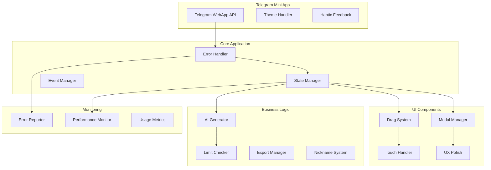

# Design Document

## Overview

FlashPost MVP Release представляет собой финальную стабильную версию Telegram Mini App для создания Instagram каруселей. Дизайн фокусируется на устранении всех критических проблем, обеспечении стабильности, полной совместимости с Telegram WebApp и реализации UX улучшений для готовности к продакшену.

Система построена как single-page application с модульной архитектурой, обеспечивающей надежность, производительность и удобство сопровождения.

## Architecture

### Общая архитектура



### Принципы дизайна

1. **Defensive Programming**: Все функции защищены try/catch блоками
2. **Graceful Degradation**: Fallback механизмы для всех внешних зависимостей
3. **Error Recovery**: Система продолжает работу даже при частичных сбоях
4. **Performance First**: Оптимизация для 60fps и быстрой загрузки
5. **Mobile First**: Приоритет touch-интерфейса и мобильной производительности

## Components and Interfaces

### Error Handler

Центральная система обработки ошибок, обеспечивающая стабильность приложения.

```javascript
interface ErrorHandler {
    // Глобальная обработка ошибок
    setupGlobalHandlers(): void;
    
    // Логирование ошибок с контекстом
    logError(error: Error, context: string, userAction?: string): void;
    
    // Отправка критических ошибок в мониторинг
    reportCriticalError(error: Error, userContext: UserContext): void;
    
    // Восстановление после ошибки
    recoverFromError(errorType: string): boolean;
}

interface UserContext {
    userTier: 'FREE' | 'PRO';
    currentSlide: number;
    totalSlides: number;
    activeTool: string;
    timestamp: number;
}
```

### Telegram WebApp Integration

Безопасная интеграция с Telegram Mini App API с fallback для браузеров.

```javascript
interface TelegramWebApp {
    // Безопасная инициализация
    safeInitialize(): Promise<boolean>;
    
    // Применение темы Telegram
    applyTheme(themeParams: TelegramTheme): void;
    
    // Haptic feedback с fallback
    hapticFeedback(type: 'light' | 'medium' | 'success' | 'selection'): void;
    
    // Проверка доступности API
    isAvailable(): boolean;
    
    // Получение пользовательских данных
    getUserData(): TelegramUser | null;
}

interface TelegramTheme {
    bg_color?: string;
    text_color?: string;
    button_color?: string;
    button_text_color?: string;
    header_bg_color?: string;
}
```

### Drag System

Стабильная система перетаскивания с поддержкой touch устройств.

```javascript
interface DragSystem {
    // Начало перетаскивания
    startDrag(event: MouseEvent | TouchEvent, element: HTMLElement, textData: TextBlock): void;
    
    // Обработка движения
    handleDragMove(event: MouseEvent | TouchEvent): void;
    
    // Завершение перетаскивания
    endDrag(): void;
    
    // Ограничение позиций
    constrainPosition(x: number, y: number): Position;
    
    // Очистка event listeners
    cleanup(): void;
}

interface TextBlock {
    id: string;
    content: string;
    x: number; // 10-90%
    y: number; // 10-90%
    width: number;
    fontSize: number;
    fontWeight: string;
    color: string;
    textAlign: string;
}

interface Position {
    x: number;
    y: number;
}
```

### Modal Manager

Унифицированная система управления модальными окнами.

```javascript
interface ModalManager {
    // Показать модальное окно
    showModal(modalId: string, focusElement?: string): void;
    
    // Скрыть модальное окно
    hideModal(modalId: string): void;
    
    // Обработка клика вне модала
    handleOutsideClick(event: MouseEvent): void;
    
    // Управление фокусом
    manageFocus(modalElement: HTMLElement): void;
    
    // Предотвращение скролла body
    preventBodyScroll(prevent: boolean): void;
}
```

### UX Polish System

Система UX улучшений для финального релиза.

```javascript
interface UXPolish {
    // Управление никнеймом
    nicknameManager: NicknameManager;
    
    // Навигационные подсказки
    navigationHints: NavigationHints;
    
    // CTA система
    ctaManager: CTAManager;
    
    // Анимации и переходы
    animationManager: AnimationManager;
}

interface NicknameManager {
    // Показать модал ввода никнейма
    showNicknameModal(): void;
    
    // Установить никнейм
    setNickname(nickname: string): void;
    
    // Обновить никнейм в слайдах
    updateNicknameInSlides(nickname: string): void;
    
    // Валидация никнейма
    validateNickname(nickname: string): boolean;
}

interface NavigationHints {
    // Показать подсказку свайпа
    showSwipeHint(): void;
    
    // Обновить индикаторы слайдов
    updateSlideIndicators(current: number, total: number, isFirst: boolean, isLast: boolean): void;
    
    // Управление состоянием кнопок
    updateNavigationButtons(canGoPrev: boolean, canGoNext: boolean): void;
}

interface CTAManager {
    // Генерация CTA для последнего слайда
    generateCTA(nickname: string): string;
    
    // Обновление CTA при изменении никнейма
    updateCTA(nickname: string): void;
    
    // Проверка является ли слайд последним
    isLastSlide(slideIndex: number, totalSlides: number): boolean;
}
```

### AI Generator

Система генерации контента с учетом лимитов и обработкой ошибок.

```javascript
interface AIGenerator {
    // Генерация контента по теме
    generateContent(topic: string): Promise<GeneratedContent>;
    
    // Проверка лимитов
    checkGenerationLimit(userTier: string): boolean;
    
    // Обновление счетчика использования
    updateUsageCount(): void;
    
    // Создание mock контента (для MVP)
    generateMockContent(topic: string): GeneratedContent;
    
    // Обработка ошибок генерации
    handleGenerationError(error: Error): void;
}

interface GeneratedContent {
    slides: SlideData[];
    totalSlides: number;
    generatedAt: Date;
}

interface SlideData {
    id: number;
    background: string;
    texts: TextBlock[];
    isFirstSlide?: boolean;
    isLastSlide?: boolean;
}
```

### Limit Checker

Система проверки FREE/PRO лимитов.

```javascript
interface LimitChecker {
    // Проверка лимита по функции
    checkLimit(feature: 'slides' | 'ai' | 'texts', userTier: string): boolean;
    
    // Получение лимитов пользователя
    getUserLimits(userTier: string): UserLimits;
    
    // Проверка возможности добавления слайда
    canAddSlide(currentSlides: number, userTier: string): boolean;
    
    // Проверка лимита AI генерации
    canUseAI(usageToday: number, userTier: string): boolean;
    
    // Проверка лимита текстовых блоков
    canAddTextBlock(currentTexts: number, userTier: string): boolean;
}

interface UserLimits {
    maxSlides: number;
    aiGenerationsPerDay: number;
    maxTextsPerSlide: number;
}
```

### Export Manager

Система экспорта каруселей с поддержкой разных форматов.

```javascript
interface ExportManager {
    // Экспорт в указанном качестве
    exportSlides(quality: '720p' | '1080p' | '4K', format: 'PNG' | 'PDF'): Promise<ExportResult>;
    
    // Проверка доступности формата
    isFormatAvailable(format: string, userTier: string): boolean;
    
    // Генерация превью экспорта
    generatePreview(slides: SlideData[]): Promise<string>;
    
    // Обработка процесса экспорта
    handleExportProcess(options: ExportOptions): Promise<void>;
}

interface ExportOptions {
    quality: string;
    format: string;
    slides: SlideData[];
    watermark: boolean;
}

interface ExportResult {
    success: boolean;
    files: string[];
    error?: string;
}
```

### Touch Handler

Система обработки touch событий с конвертацией в mouse события.

```javascript
interface TouchHandler {
    // Конвертация touch в mouse события
    convertTouchToMouse(touchEvent: TouchEvent): MouseEvent;
    
    // Обработка swipe жестов
    handleSwipeGesture(startTouch: Touch, endTouch: Touch): SwipeDirection | null;
    
    // Предотвращение конфликтов событий
    preventEventConflicts(event: Event): void;
    
    // Очистка touch listeners
    cleanupTouchListeners(): void;
}

type SwipeDirection = 'left' | 'right' | 'up' | 'down';
```

## Data Models

### Application State

```javascript
interface AppState {
    // Пользовательские данные
    user: UserData;
    
    // Состояние слайдов
    slides: SlideData[];
    currentSlide: number;
    totalSlides: number;
    
    // UI состояние
    ui: UIState;
    
    // Состояние инструментов
    tools: ToolsState;
    
    // Состояние ошибок
    errors: ErrorState[];
}

interface UserData {
    nickname: string;
    tier: 'FREE' | 'PRO';
    aiUsageToday: number;
    preferences: UserPreferences;
}

interface UIState {
    activeTool: string;
    selectedTextBlock: string | null;
    isDragging: boolean;
    modalsOpen: string[];
    loading: boolean;
}

interface ToolsState {
    dragState: DragState;
    exportState: ExportState;
    aiState: AIState;
}

interface DragState {
    isDragging: boolean;
    startX: number;
    startY: number;
    startLeft: number;
    startTop: number;
    element: HTMLElement | null;
}

interface ErrorState {
    id: string;
    message: string;
    context: string;
    timestamp: Date;
    severity: 'low' | 'medium' | 'high' | 'critical';
    resolved: boolean;
}
```

### Configuration

```javascript
interface AppConfig {
    // Лимиты пользователей
    limits: {
        FREE: UserLimits;
        PRO: UserLimits;
    };
    
    // Настройки производительности
    performance: PerformanceConfig;
    
    // Настройки мониторинга
    monitoring: MonitoringConfig;
    
    // Настройки экспорта
    export: ExportConfig;
}

interface PerformanceConfig {
    maxFPS: number;
    debounceDelay: number;
    animationDuration: number;
    loadTimeout: number;
}

interface MonitoringConfig {
    errorReportingEnabled: boolean;
    errorRateLimit: number;
    performanceTrackingEnabled: boolean;
    usageAnalyticsEnabled: boolean;
}

interface ExportConfig {
    supportedFormats: string[];
    qualityOptions: string[];
    maxFileSize: number;
    compressionLevel: number;
}
```

## Correctness Properties

*A property is a characteristic or behavior that should hold true across all valid executions of a system-essentially, a formal statement about what the system should do. Properties serve as the bridge between human-readable specifications and machine-verifiable correctness guarantees.*

### Property 1: Comprehensive Error Handling
*For any* JavaScript error, promise rejection, or function exception, the Error_Handler should catch, log, and handle the error gracefully without crashing the application, providing fallback behavior where possible
**Validates: Requirements 1.1, 1.2, 1.4**

### Property 2: Input Validation
*For any* function input parameter, the FlashPost_System should validate the input before processing and handle invalid inputs gracefully
**Validates: Requirements 1.5**

### Property 3: Null Reference Safety
*For any* DOM element access attempt, the FlashPost_System should check for element existence and handle null references without crashing
**Validates: Requirements 1.3**

### Property 4: Telegram WebApp Fallback
*For any* Telegram WebApp API call, the system should provide fallback functionality when the API is unavailable and continue working in browser mode
**Validates: Requirements 2.1, 2.5**

### Property 5: Theme Application
*For any* available Telegram theme parameters, the Telegram_WebApp should apply the theme colors to the interface correctly
**Validates: Requirements 2.3**

### Property 6: Haptic Feedback
*For any* user interaction that supports haptic feedback, the Telegram_WebApp should provide haptic feedback when the API is available
**Validates: Requirements 2.4**

### Property 7: Drag Position Constraints
*For any* drag operation on a text block, the Drag_System should constrain the final position to 10-90% of the slide area to prevent edge overflow
**Validates: Requirements 3.2**

### Property 8: Drag Position Calculation
*For any* drag movement, the Drag_System should calculate positions accurately within slide boundaries
**Validates: Requirements 3.1**

### Property 9: Touch to Mouse Event Conversion
*For any* touch event on draggable elements, the Touch_Handler should convert touch events to equivalent mouse events seamlessly
**Validates: Requirements 3.3, 6.2**

### Property 10: Drag Visual Feedback
*For any* drag operation, the Drag_System should provide visual feedback with scaling and z-index changes during dragging
**Validates: Requirements 3.4**

### Property 11: Event Listener Cleanup
*For any* completed drag operation, the Drag_System should clean up all associated event listeners properly
**Validates: Requirements 3.5, 6.4**

### Property 12: Modal CSS Consistency
*For any* modal window, the Modal_Manager should use unified CSS classes for consistent styling
**Validates: Requirements 4.1**

### Property 13: Modal Focus Management
*For any* opened modal, the Modal_Manager should focus the appropriate input element and manage focus correctly
**Validates: Requirements 4.2**

### Property 14: Modal Closing Behavior
*For any* modal close action (button click or outside click), the Modal_Manager should close the modal properly
**Validates: Requirements 4.3**

### Property 15: Modal Error Handling
*For any* modal operation when modal elements are missing, the Modal_Manager should handle errors gracefully without crashing
**Validates: Requirements 4.4**

### Property 16: Modal Scroll Prevention
*For any* open modal, the Modal_Manager should prevent body scrolling while the modal is active
**Validates: Requirements 4.5**

### Property 17: Comprehensive Limit Checking
*For any* user action (adding slides, using AI, adding text blocks), the Limit_Checker should validate against user tier limits and prevent actions that exceed limits
**Validates: Requirements 5.1, 5.2, 5.3**

### Property 18: PRO Upgrade Effect
*For any* user upgrade to PRO, the FlashPost_System should immediately remove all PRO locks and update limit checking
**Validates: Requirements 5.4**

### Property 19: Limit Validation Error Handling
*For any* limit validation error, the Limit_Checker should handle the error gracefully and provide appropriate feedback
**Validates: Requirements 5.5**

### Property 20: Touch Event Default Prevention
*For any* touch event, the Touch_Handler should prevent default browser behavior to avoid conflicts with custom handling
**Validates: Requirements 6.1**

### Property 21: Swipe Gesture Recognition
*For any* swipe gesture on the slide preview, the Touch_Handler should recognize the gesture and trigger appropriate slide navigation
**Validates: Requirements 6.3**

### Property 22: Multi-touch Handling
*For any* multi-touch scenario, the Touch_Handler should handle the events gracefully without causing conflicts
**Validates: Requirements 6.5**

### Property 23: Nickname Prefix Addition
*For any* nickname input without @ prefix, the UX_Polish should automatically add the @ prefix
**Validates: Requirements 7.2**

### Property 24: Comprehensive Nickname Updates
*For any* nickname change, the UX_Polish should update the nickname in the header, first slide welcome text, and last slide CTA text
**Validates: Requirements 7.3, 7.4, 9.3**

### Property 25: Nickname Edit Access
*For any* click on the header nickname, the UX_Polish should open the nickname editing modal
**Validates: Requirements 7.5**

### Property 26: Slide Indicator Icons
*For any* slide navigation, the UX_Polish should show appropriate icons (🏠 for first slide, 🎯 for last slide) in the slide indicators
**Validates: Requirements 8.2**

### Property 27: Navigation Button States
*For any* slide position, the UX_Polish should disable the previous button on the first slide and the next button on the last slide
**Validates: Requirements 8.3, 8.4**

### Property 28: Keyboard Navigation
*For any* keyboard arrow key press, the UX_Polish should navigate between slides appropriately
**Validates: Requirements 8.5**

### Property 29: Last Slide Marking
*For any* slide creation or modification, the UX_Polish should mark the last slide with the isLastSlide flag
**Validates: Requirements 9.1**

### Property 30: CTA Text Generation
*For any* last slide, the UX_Polish should automatically generate CTA text in the format "Подпишись на @nickname"
**Validates: Requirements 9.2**

### Property 31: AI-Generated CTA Inclusion
*For any* AI-generated slide set, the UX_Polish should ensure the last slide contains a CTA with the user's nickname
**Validates: Requirements 9.5**

### Property 32: Error Statistics Collection
*For any* error occurrence, the Error_Handler should collect error statistics and user context for monitoring
**Validates: Requirements 10.2**

### Property 33: Critical Error Reporting
*For any* critical error, the Error_Handler should send error reports to the monitoring service
**Validates: Requirements 10.3**

### Property 34: Error Rate Limiting
*For any* sequence of errors, the Error_Handler should implement rate limiting to prevent spam reporting
**Validates: Requirements 10.4**

### Property 35: Error Recovery
*For any* recoverable error, the Error_Handler should provide error recovery mechanisms where possible
**Validates: Requirements 10.5**

### Property 36: Interaction Debouncing
*For any* frequent user interaction, the FlashPost_System should implement debouncing to prevent excessive processing
**Validates: Requirements 11.4**

### Property 37: Export Format Availability
*For any* export request, the Export_Manager should provide 720p PNG for FREE users and additional formats (1080p, 4K, PDF) for PRO users
**Validates: Requirements 12.1, 12.2**

### Property 38: Export Progress Indication
*For any* export operation, the Export_Manager should show progress indication during the export process
**Validates: Requirements 12.3**

### Property 39: Export Dimension Compliance
*For any* exported file, the Export_Manager should generate files with proper Instagram carousel dimensions
**Validates: Requirements 12.4**

### Property 40: Export Completion Handling
*For any* completed export, the Export_Manager should provide download links or save files locally
**Validates: Requirements 12.5**

### Property 41: AI Content Generation
*For any* topic input, the AI_Generator should generate relevant slide content with appropriate backgrounds and styling
**Validates: Requirements 13.1, 13.4**

### Property 42: AI Usage Limits
*For any* AI generation request, the AI_Generator should respect user tier limits (3/day for FREE, unlimited for PRO)
**Validates: Requirements 13.2**

### Property 43: AI Loading State
*For any* AI generation in progress, the AI_Generator should show loading state to the user
**Validates: Requirements 13.3**

### Property 44: AI Error Recovery
*For any* AI generation failure, the AI_Generator should show error message and restore UI state properly
**Validates: Requirements 13.5**

### Property 45: API Graceful Degradation
*For any* unavailable browser API, the FlashPost_System should gracefully degrade features while maintaining core functionality
**Validates: Requirements 14.5**

## Error Handling

### Error Categories

1. **Critical Errors**: System crashes, data corruption, security breaches
   - Immediate error reporting to monitoring service
   - Automatic recovery attempts
   - User notification with recovery options

2. **High Priority Errors**: Feature failures, API errors, export failures
   - Error logging with full context
   - Fallback behavior activation
   - User notification with alternative actions

3. **Medium Priority Errors**: UI glitches, minor feature issues, validation errors
   - Error logging for debugging
   - Graceful degradation
   - Silent recovery when possible

4. **Low Priority Errors**: Performance warnings, deprecated API usage
   - Debug logging only
   - No user impact
   - Background monitoring

### Error Recovery Strategies

```javascript
interface ErrorRecovery {
    // Automatic retry with exponential backoff
    retryWithBackoff(operation: Function, maxRetries: number): Promise<any>;
    
    // Fallback to alternative implementation
    fallbackToAlternative(primaryFunction: Function, fallbackFunction: Function): any;
    
    // State restoration after error
    restoreState(previousState: AppState): void;
    
    // User-guided recovery
    promptUserRecovery(error: Error, recoveryOptions: RecoveryOption[]): Promise<void>;
}
```

### Monitoring Integration

```javascript
interface ErrorMonitoring {
    // Initialize monitoring service
    initialize(config: MonitoringConfig): void;
    
    // Report error with context
    reportError(error: Error, context: ErrorContext): void;
    
    // Track performance metrics
    trackPerformance(metric: PerformanceMetric): void;
    
    // Monitor user behavior
    trackUserAction(action: UserAction): void;
}
```

## Testing Strategy

### Dual Testing Approach

The testing strategy employs both unit tests and property-based tests to ensure comprehensive coverage:

**Unit Tests:**
- Specific examples and edge cases
- Integration points between components
- Error conditions and boundary cases
- Modal interactions and UI state changes
- Telegram WebApp API integration scenarios

**Property-Based Tests:**
- Universal properties across all inputs
- Comprehensive input coverage through randomization
- Error handling across different error types
- Drag and drop behavior with random positions
- Limit checking with various user tiers and usage patterns

### Property-Based Testing Configuration

- **Testing Library**: fast-check for JavaScript property-based testing
- **Minimum Iterations**: 100 iterations per property test
- **Test Tagging**: Each property test tagged with format: **Feature: flashpost-mvp-release, Property {number}: {property_text}**
- **Error Injection**: Systematic error injection to test error handling properties
- **Mock Integration**: Comprehensive mocking of external APIs (Telegram WebApp, monitoring services)

### Test Categories

1. **Error Handling Tests**
   - Property tests for all error scenarios
   - Unit tests for specific error recovery cases
   - Integration tests for monitoring service communication

2. **Drag & Drop Tests**
   - Property tests for position constraints and calculations
   - Unit tests for touch event conversion
   - Integration tests for cross-browser compatibility

3. **Modal Management Tests**
   - Property tests for modal lifecycle management
   - Unit tests for focus management and accessibility
   - Integration tests for keyboard navigation

4. **Limit Checking Tests**
   - Property tests for all limit scenarios across user tiers
   - Unit tests for edge cases (exactly at limit, upgrade scenarios)
   - Integration tests for PRO upgrade flow

5. **UX Polish Tests**
   - Property tests for nickname propagation and CTA generation
   - Unit tests for navigation state management
   - Integration tests for keyboard shortcuts and swipe gestures

6. **Performance Tests**
   - Load time validation (target: <2 seconds on 3G)
   - Animation performance monitoring (target: 60fps)
   - Memory usage stability tests
   - Debouncing effectiveness tests

### Test Environment Setup

```javascript
// Property test configuration
const propertyTestConfig = {
    numRuns: 100,
    timeout: 5000,
    seed: Math.random(),
    verbose: true
};

// Mock Telegram WebApp API
const mockTelegramWebApp = {
    ready: jest.fn(),
    expand: jest.fn(),
    themeParams: { bg_color: '#ffffff' },
    HapticFeedback: {
        impactOccurred: jest.fn(),
        notificationOccurred: jest.fn(),
        selectionChanged: jest.fn()
    }
};

// Error monitoring mock
const mockErrorMonitoring = {
    reportError: jest.fn(),
    trackPerformance: jest.fn(),
    trackUserAction: jest.fn()
};
```

Each property test must reference its corresponding design document property and validate the universal behavior across all valid inputs, ensuring the FlashPost MVP is robust, stable, and ready for production deployment.